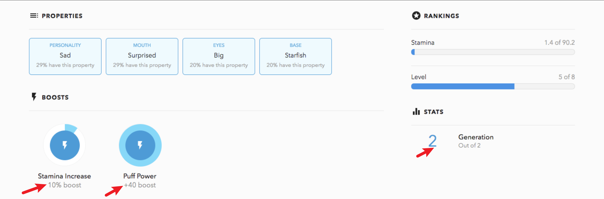

# Metadata

Metadata 通常直译为“元数据”，本质上是 NFT 内容的描述数据，遵循 JSON 的数据格式标准。

Metadata 是铸造 NFT 流程中重要的一环，如果 Metadata 的数据格式不符合标准，那么在像 OpenSea 这样的 NFT 平台上是无法正确显示 NFT 相关的属性信息，比如名称、描述和图像等等。

非同质化是 NFT 最重要的属性，绝大多数NFT系列是由符合 ERC-721 标准或 ERC-1155 标准的合约所创建的，ERC-721 和 ERC-1155提供了 Metadata 的拓展选项，能够更好的诠释 NFT 的名称和数据内容。NFT 的非同质化也更多的被 Metadata 中截然不同的数据形式和内容所体现。

## Metadata 数据结构
Opensea 根据以太坊官方的 EIP-721 metadata 标准和 EIP-1155 所建议的数据格式来实现平台对 Metadata 的支持。

除此之外，OpenSea 额外支持了其他几个多媒体附件的属性（包括音频、视频和 3D 模型），以及项目的交互式特征。

OpenSea Metadata 示例：

```JSON
{
  "name": "Dave Starbelly",
  "description": "Friendly OpenSea Creature that enjoys long swims in the ocean.", 
  "image": "https://storage.googleapis.com/opensea-prod.appspot.com/puffs/3.png", 
  "external_url": "https://openseacreatures.io/3", 
  "attributes": [ ... ], 
}
```
| 属性      | 描述 |
| ----------- | ----------- |
| name | NFT 的名称 |
| description | NFT 的描述语句 |
| image | NFT 最终展示的图片链接 |
| attributes | NFT 的特征信息 |
| external_url | OpenSea 上资产图像下方的 URL，允许用户离开 OpenSea 并在您的站点上查看该项目|
|background_color|OpenSea 上项目的背景颜色。必须是不带前置 # 的六字符十六进制|
|youtube_url|YouTube 视频的 URL|
|animation_url| 项目多媒体附件的 URL，支持文件扩展名 GLTF、GLB、WEBM、MP4、M4V、OGV 和 OGG，以及仅音频扩展名 MP3、WAV 和 OGA。还支持 HTML 页面，允许您使用 JavaScript 画布、WebGL 等构建丰富的体验和交互式 NFT。|


### Attributes 属性
为了让 NFT 表现的内容更加丰富，Opensea 允许将自定义属性添加到 Metadata 中，这些属性将显示在每个 NFT 下方，可点击[这里](https://testnets.opensea.io/assets/0x7dca125b1e805dc88814aed7ccc810f677d3e1db/25)查看Testnet NFT 示例。

若要显示 attributes 的自定义属性，Metadata 数据中需要添加以下属性数组：
```JSON
...
{
"attributes": [
    {
      "trait_type": "Base", 
      "value": "Starfish"
    }, 
    {
      "trait_type": "Eyes", 
      "value": "Big"
    }, 
    {
      "trait_type": "Mouth", 
      "value": "Surprised"
    }, 
    {
      "trait_type": "Level", 
      "value": 5
    }, 
    {
      "trait_type": "Stamina", 
      "value": 1.4
    }, 
    {
      "trait_type": "Personality", 
      "value": "Sad"
    }, 
    {
      "display_type": "boost_number", 
      "trait_type": "Aqua Power", 
      "value": 40
    }, 
    {
      "display_type": "boost_percentage", 
      "trait_type": "Stamina Increase", 
      "value": 10
    }, 
    {
      "display_type": "number", 
      "trait_type": "Generation", 
      "value": 2
    }
  ]
}
```
另外 Opensea 还支持数字特征与日期特征的属性显示。

对于数字特征的属性，Opensea 目前支持三种不同的选项：`number`，`boost_percentage`，`boost_number`。

示例：
```JSON
...
{
"attributes": [
    {
      "display_type": "boost_number", 
      "trait_type": "Aqua Power", 
      "value": 40
    }, 
    {
      "display_type": "boost_percentage", 
      "trait_type": "Stamina Increase", 
      "value": 10
    }, 
    {
      "display_type": "number", 
      "trait_type": "Generation", 
      "value": 2
    }
  ]
}
```
这在 Opensea 上将会表现为如下：



对于日期特征的属性，需要传入 unix 时间戳（秒）作为值。
```JSON
    {
      "display_type": "date", 
      "trait_type": "birthday", 
      "value": 1546360800
    }
```
这在 Opensea 上将会表现为如下：


## 如何读取 Metadata
之前 EIP-721 和 EIP-1155 标准并没有对 Metadata 有强制性的规范，NFT 与 Metadata 绑定关联是很随意的事情，需要有统一的标准来进行规范，之后出现的 ERC-721Metadata 和 ERC-1155Metadata 则是提供了一套标准方法和必要的变量，当用户调用这一方法时，只需要查看的 Token Id，便能得到得到对应的 Metadata。

```Solidity
/* @dev Returns an URI for a given token ID */

function tokenURI(uint256 _tokenId) public view returns (string) {
  return Strings.strConcat(
      baseTokenURI(),
      Strings.uint2str(_tokenId)
  );
}
```
ERC721 中的函数或 ERC1155 合约中的函数应返回 HTTP 或 IPFS URL。查询时，此 URL 应返回一个 JSON 数据源，其中包含了 Token 的 Metadata。
