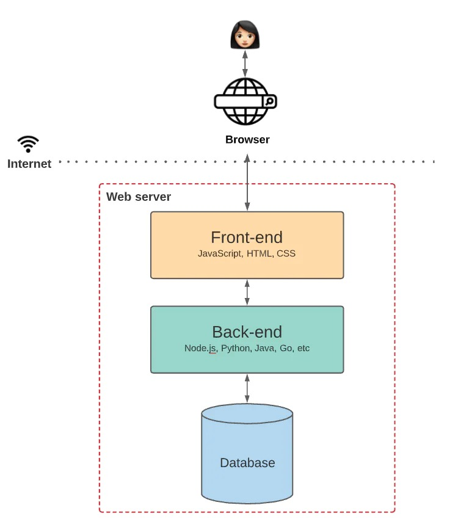
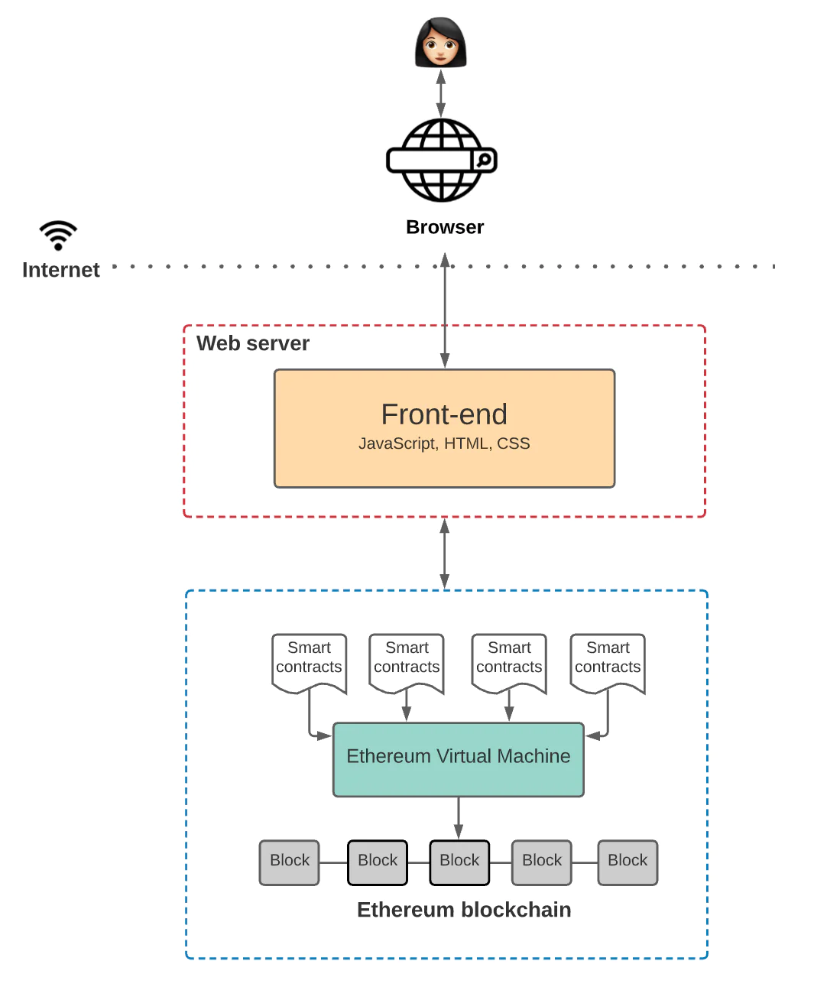
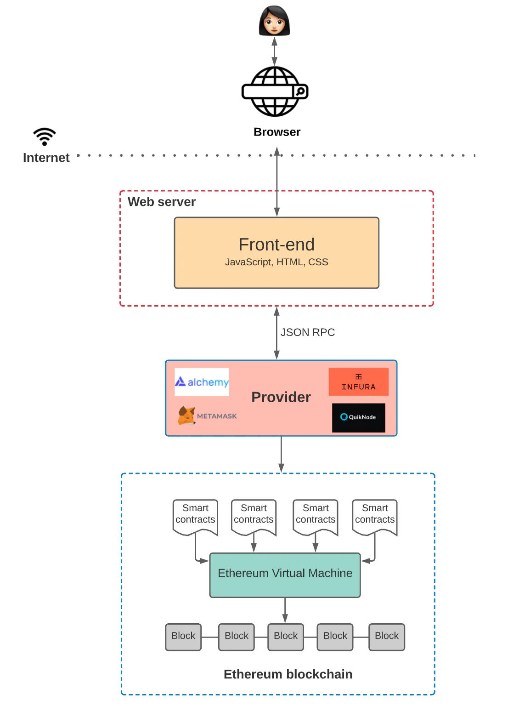

# 全站开发的基本概观

整理者：＠0xRory

> 通常 Web3.0 資訊量非常的大，常常會讓開發人員暈圖轉向或是迷失學習的方向，所以需要先了解整個構思路才會比較清晰，才可以決定想學哪些東西。
而本章節整理網路資料帶大家整理思路！

- 架構
- 是什么让 Web 3.0 与众不同

## 架構
***
首先我們用 [Medium](https://medium.com/) 舉例，我們都知道這是部落格所以我們可以分成前端、後端、資料庫。

 

| 功能  | 技術                                | 功能          |   |   |   |   |   |   |   |
|-----|-----------------------------------|-------------|---|---|---|---|---|---|---|
| 前端  | html,javascript,css,React,Vue etc | 呈現畫面和使用者互動  |   |   |   |   |   |   |   |
| 後端  | Node.js,Python,Go etc             | 提供前端資料及互動資料 |   |   |   |   |   |   |   |
| 資料庫 | mysql, postgresql etc.            | 記錄資料位置      |   |   |   |   |   |   |   |

 
然而 前端＋後端＋資料庫 ＝ 網站
 

如下圖：

### 是什么让 Web 3.0 与众不同
***

其实看到这里我们要想一下 Web 3.0 给了我们什么，最大的不同就是利用区块链技术将个人状态或资公开的维护（当然我们看到的都是肉眼无法辨识的地址或讯息），而不像过去Web 2.0 由某个企业拥有你的资料（中心化）。

如下图，可以看到是资料库这段的改变(这以要澄清区块链技术不是取代资料库的方法，而是意义上的不同）：

ex： 
    1. 企业有会员资料并架设在云平台上 🗒 资料拥有人"企业，云平台" 
    2. 透过区块链技术记录 🗒 资料拥有人"节点上所有人" 
    （ps. 如果链上数据要修改要全网50%的人同意才能修改 🧑‍🔧，基本上不可能）

#### 补充
- 区块链 :  
    由点对点网路形成，状态是依照网路共识原则，要修改都要全网百分之50%同意才可以，修改并会留有记录！
- 智能合约 :  
    在区块链上执行的应用程式，公开且不可修改（顶多部分更新）。

### 前端与智能合约交互
***

首先要想取得链上资料或控制智能合约，一定需要"链的节点"  
（可以这样想像如果正常网页上我们呼叫资料一定会有一台服务器帮我们资料的回覆，让前端可以做呈现） 
但是一般人可能没有这些能量或技术建一个节点所以出现了一些第三方公司来提供这样的服务 Infura、 Alchemy 和 Quicknode

 

| 方法  |  工具                               | 优点          | 缺点  |   |   |   |   |   |   |
|-----|-----------------------------------|-------------|---|---|---|---|---|---|---|
| 自己架设节点  |go-ethereum、Cosmos SDK、lotus etc | 操控性高  | 技术门槛较高  |   |   |   |   |   |   |
| 使用第三方服务  | Infura、 Alchemy 和 Quicknode            | 提供工具较完善、不需要自己建立节点  | 受限于提供商  |   |   |   |   |   |   |

想像一下就如下图：

## Risks

引用：
https://web3caff.com/zh/archives/4085