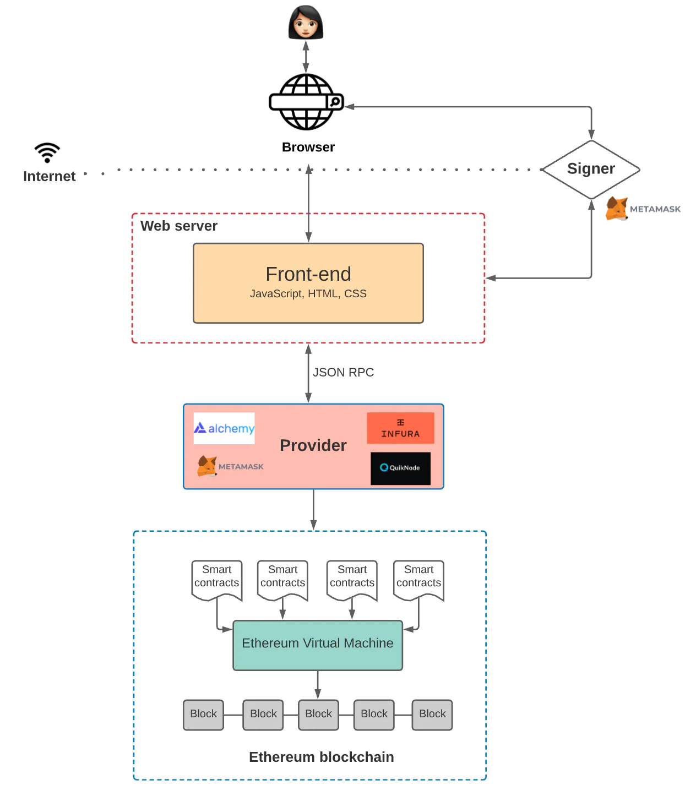
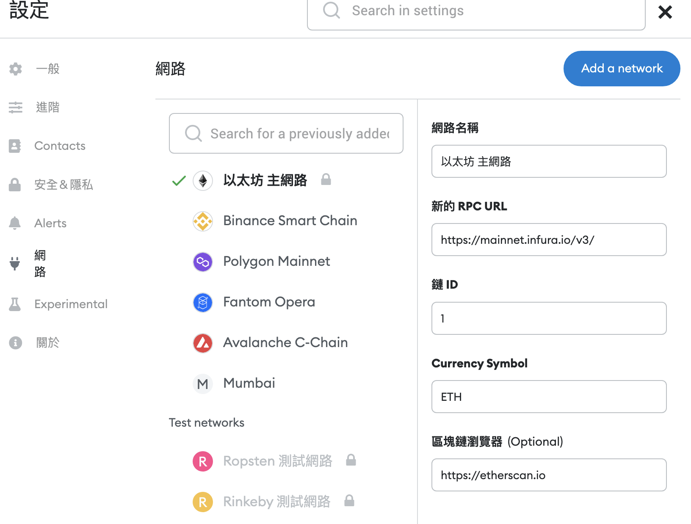
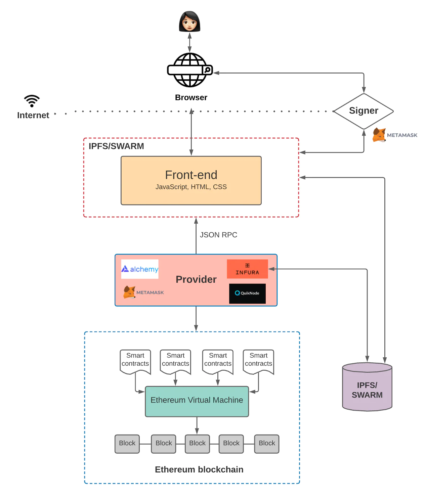

0.全站开发的基本概观

整理者：[0xRory](https://github.com/0xRory)

> 通常 Web3.0 资讯量非常的大，常常会让开发人员晕图转向或是迷失学习的方向，所以需要先了解整个构思路才会比较清晰，才可以决定想学哪些东西。而本章节整理网路资料带大家整理思路！

- [架构](##架构)
- 是什么让 Web 3.0 与众不同
- 前端与智能合约交互
- 提供商（Provider）
- 区块链中的存储

## 架构
***
首先我们用 [Medium](https://medium.com/) 举例，我们都知道这是部落格所以我们可以分成前端、后端、资料库。

 

| 功能  | 技术                                | 功能          |
|-----|-----------------------------------|-------------|
| 前端  | html,javascript,css,React,Vue etc | 呈现画面和使用者互动  |
| 后端  | Node.js,Python,Go etc             | 提供前端资料及互动资料 |
| 资料库 | mysql, postgresql etc.            | 记录资料位置       |

 
然而 前端＋后端＋资料库 ＝ 网站
 

如下图：

### 是什么让 Web 3.0 与众不同
***

其实看到这里我们要想一下 Web 3.0 给了我们什么，最大的不同就是利用区块链技术将个人状态或资公开的维护（当然我们看到的都是肉眼无法辨识的地址或讯息），而不像过去Web 2.0 由某个企业拥有你的资料（中心化）。

如下图，可以看到是资料库这段的改变(这以要澄清区块链技术不是取代资料库的方法，而是意义上的不同）：

ex： 
    1. 企业有会员资料并架设在云平台上 🗒 资料拥有人"企业，云平台" 
    2. 透过区块链技术记录 🗒 资料拥有人"节点上所有人" 
    （ps. 如果链上数据要修改要全网50%的人同意才能修改 🧑‍🔧，基本上不可能）

#### 补充
- 区块链 :  
    由点对点网路形成，状态是依照网路共识原则，要修改都要全网百分之50%同意才可以，修改并会留有记录！
- 智能合约 :  
    在区块链上执行的应用程式，公开且不可修改（顶多部分更新）。

### 前端与智能合约交互
***

首先要想取得链上资料或控制智能合约，一定需要"链的节点"  
（可以这样想像如果正常网页上我们呼叫资料一定会有一台服务器帮我们资料的回覆，让前端可以做呈现） 
但是一般人可能没有这些能量或技术建一个节点所以出现了一些第三方公司来提供这样的服务 Infura、 Alchemy 和 Quicknode

 

| 方法  |  工具                               | 优点          | 缺点  |
|-----|-----------------------------------|-------------|---|
| 自己架设节点  |go-ethereum、Cosmos SDK、lotus etc | 操控性高  | 技术门槛较高  |
| 使用第三方服务  | Infura、 Alchemy 和 Quicknode            | 提供工具较完善、不需要自己建立节点  | 受限于提供商  |

 

想像一下就如下图：

### 提供商（Provider）
***
写道这里大家一定可以想到 Metamask，它就是提供商的一员，提供我们和合约交互(DAPP) 的一个介面。

就会变成下图：

这张图可以看到 Metamask 的强大根本就是入口阿（一级介面担当）
让我们看看下图简单的网路设定都可以到处控制链上DAPP 😅

PS. 大家可以看到其实他的节点是``infura`` !!!
 另外这边要在提醒一下 Metamask 之所以强大它是一个介面（真的只是介面...)

### 区块链中的存储
当然区块链除了记帐以外，储存空间也是一个非常迷人的一块（全世界帮你保存节点！！！）这里真的一定要提到 IPFS 和 Swarm ，当然我们这里没有要深入去理解只要知道区块链中也有储存 
[IPFS Swarm 详细介绍](https://www.bilibili.com/video/BV1dE411G79z/?vd_source=084e2f635439d07dfc94cbbad4e336e4)

到这阶段架构大概如下图

引用：
https://web3caff.com/zh/archives/4085