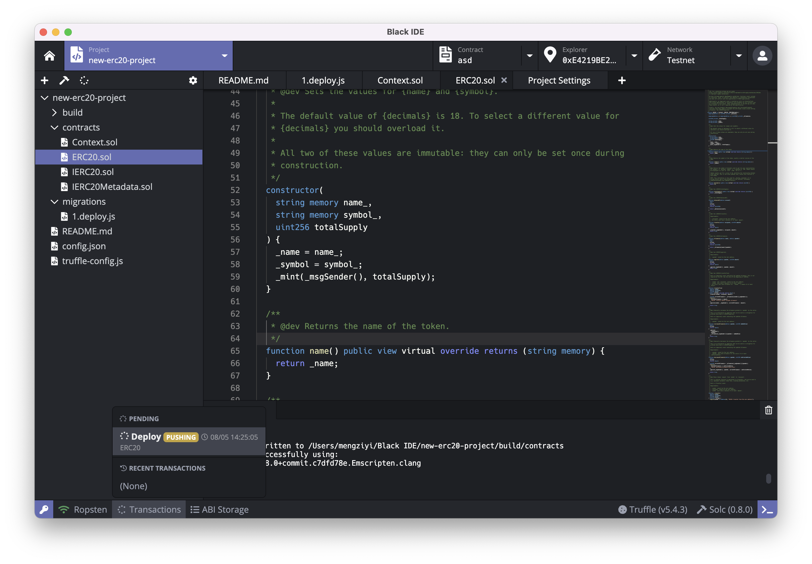
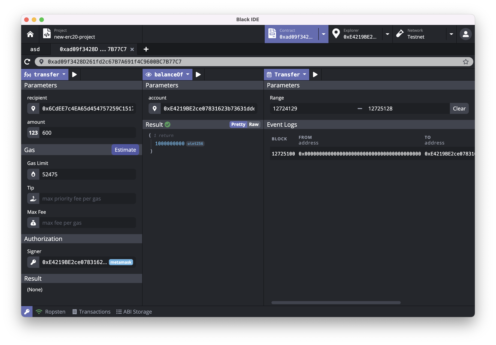

# 部署 ERC20 合约及调用 ERC 20 合约
## 使用 Black IDE 部署 ERC20 合约

1. 打开 Black IDE，在 Welcome 页面点击 Create Project 按钮新建项目

2. 选择 ERC20 Token 模板，并新建项目

3. 打开 `/contracts/ERC20.sol` 文件，编写关于本合约的内容，须按照 [ERC20 标准](https://eips.ethereum.org/EIPS/eip-20) 编写符合格式的代码内容

4. 在右上角连接你需要部署该合约的网络，并选择你部署时所需要使用的私钥（该私钥将会具有所发行代币的管理权限，获得初次发行的所有代币，请谨慎选择）

5. 点击左上角 编译按钮 编译，待编译完成后，点击左上角 部署按钮 部署。

6. 部署时需要填写 `Constructor ` 中设定的初始化参数。当前 Demo 版本将 “代币名称”、“代币符号”、“代币总发行量” 作为初始化参数填入。实际操作时可将此部分参数硬编码进代码中。

7. 点击 `Estimate & Deploy`，测试你的私钥能否正常部署
8. 点击 `Deploy` 部署合约。
9. 部署时可在左下角查看部署状态。

10. 点击 `Contract` 后方的合约地址进入合约调用界面。

## 使用 Black IDE 调用 ERC20 合约
0. 确保你当前处于正确的网络上、当前选择的私钥为你部署时使用的私钥。
1. 合约调用分为左中右三个模块，其中，左侧模块为 “合约方法调用（有数据写入）”，中间模块为 “合约方法调用（仅查询）”，右侧模块为 “合约事件查询”

2. 以转账操作为例。
  a. 首先在中间模块中选择 `balanceOf` 方法，然后在下方选择你需要查询的账号（本次选择部署合约的账号），然后点击执行按钮，可以看到，当前账号余额为 "1000000000" 。  
  
  
  b. 在左侧模块选择 `transfer` 方法，在 `recipient` 中选择你需要转入的账号，在最下方 `Signer` 中选择你需要转出的账号，在 `amount` 中选择你需要转账的代币数量。点击 Estimate ，获取最新的燃料费用，然后点击执行按钮进行转账。  
  
  
  c. 转账完成后，参照 a. 小条，查询转出的账号的余额和转入账号的余额，可以看到余额成功转出。  
  
  d. 在右侧模块中，选择 Transfer 事件并点击执行按钮，也可看到转账操作的转账记录。（下方 range 指查询区块，置空则默认查询从合约创建起到最新区块的所有转账记录，否则可以查询自定义区块上的转账记录）  
  
